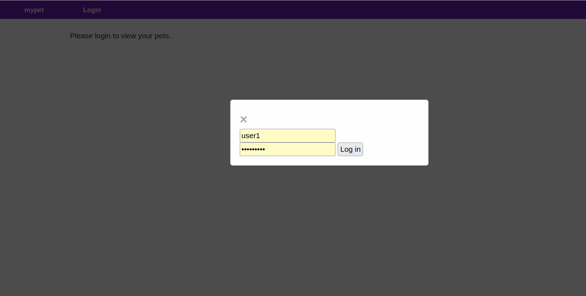
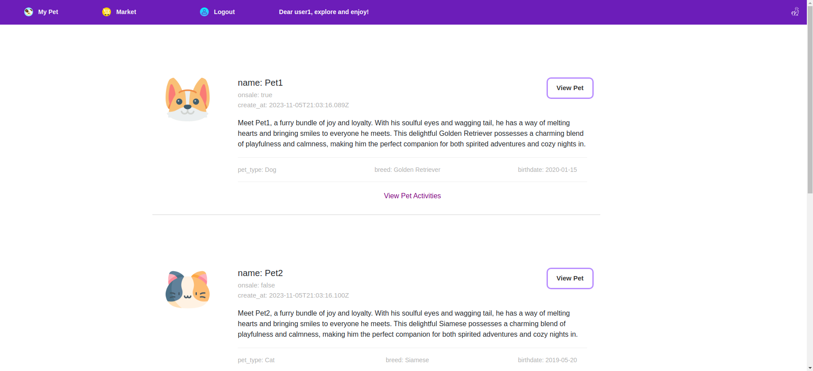
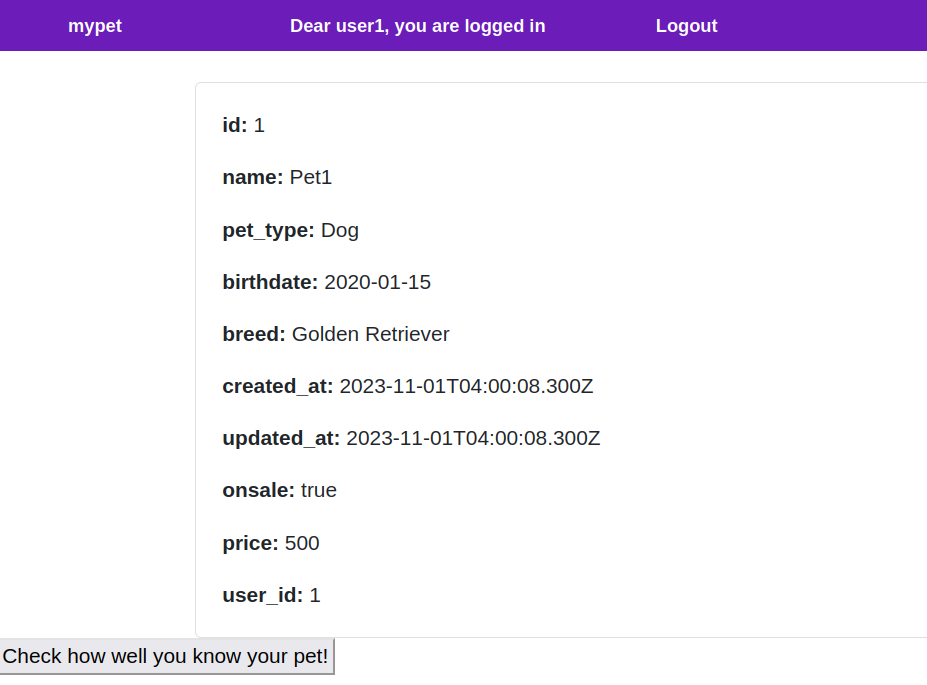
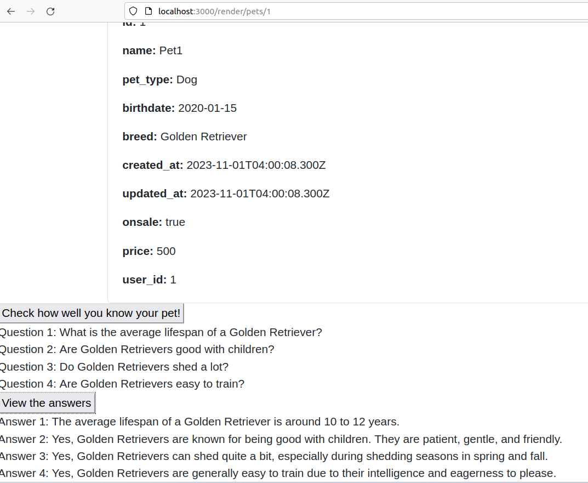
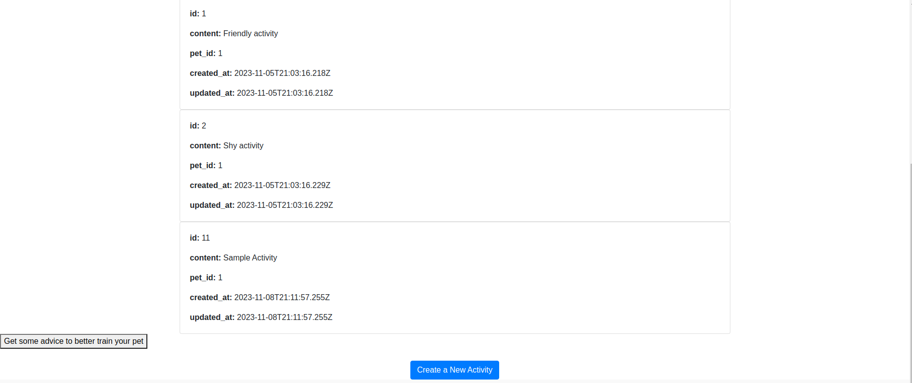
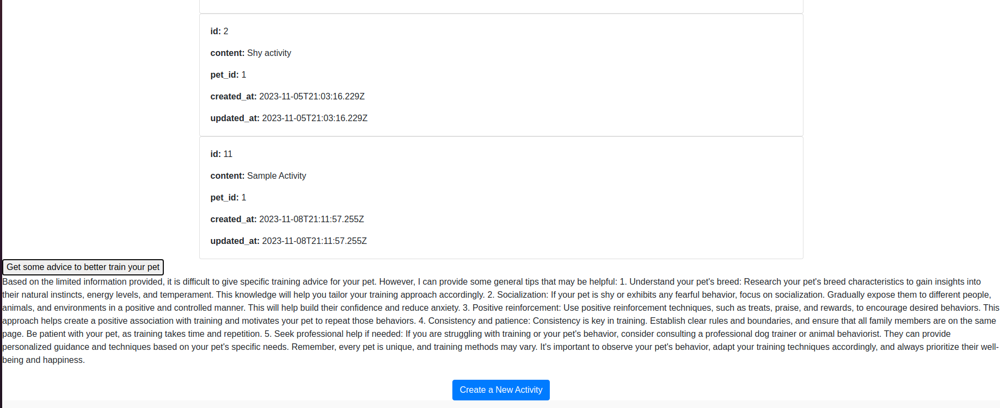
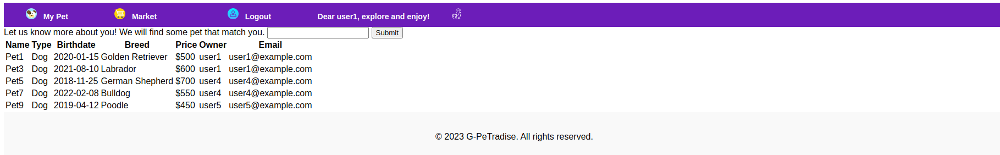
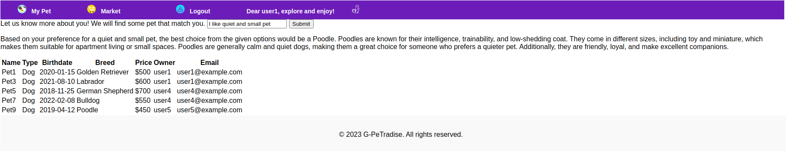

# G-PeTradise: Test, Track, Trade

**Team Members:**

Contribution History: [Link](https://github.com/Jayg000e/PetApp/graphs/contributors?from=2023-09-17&to=2023-11-04&type=c)

- Yunjia Wang   (yw4105)
- Jia Guo       (jg4692)
- Yu-Hsin Huang (yh3666)
- Hongzheng Zhu (hz2915)

## Dependencies

To get started, make sure to install Ruby version 3.1.4 using rbenv:

```shell
rbenv install --verbose 3.1.4
rbenv global 3.1.4
```

## Running the Application Locally

1. Install all the dependencies using Bundler:

```shell
bundle install --without production
```

2. Load the database:

```shell
rake db:reset
```

3. Start the local server:

```shell
rails s
```

## Running BDD and TDD Tests

We've provided both BDD (Cucumber) and TDD (RSpec) tests. To run the tests, use the following commands:

- To run BDD Cucumber tests:

Note: Chrome should be available in the test environment because selenium is used to test the UI with chrome starting from this tier. 

```shell
rake cucumber
```

- To run TDD RSpec tests:

```shell
rake spec
```

You can find coverage reports under the `coverage` folder.

## Heroku Link

For the deployed version of our application, visit our Heroku link at: https://agile-river-99147-09b2028b3c1f.herokuapp.com

### Interacting with the UI

1. **Getting Started**: Start on the homepage:

   

2. **Login**: Click on the "Login" button. You'll be prompted to enter your username and password. For demonstration, use these credentials:

   - Username: `user1`
   - Password: `password1`

   

3. **Dashboard**: After successful login, you'll land on your dashboard, displaying a list of your pets. You can also add new pets on this page.

   

4. **Pet Details**: Click on one of your pets to access its detailed information. You'll be redirected to the pet info page:

   

5. **Test Your Knowledge**: To check how well you know your pet, click on "Check how well you know your pet!" and wait for approximately 30 seconds. You will then be prompted with knowledge checks related to your pet:

   

6. **Pet Activities**: If "View pet activities" is clicked at step 3, you will be directed to the activity page of the corresponding pet:

   

7. **Get Training Advices**: To get training advices based on pet's activities, click on "Get some advices to better train your pet" and wait for approximately 30 seconds. You will then be prompted with training advices related to your pet based on its recent activities:

   

8. **Market Place**: Click on the "market" on the navigation bar. You'll be redirected to the market page:

   

9. **Get Purchasing Advices**: To get purchasing advices based on your preferences, enter your preferences and click on "submit" and wait for approximately 30 seconds. You will then be advised on which pet best suits you in the market:

   


